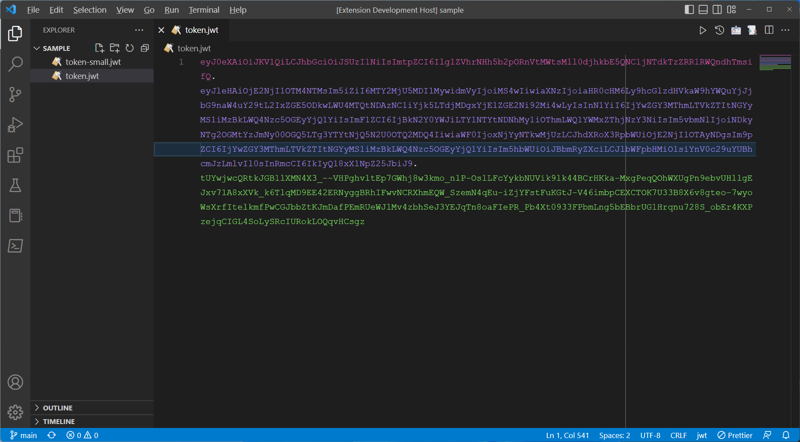
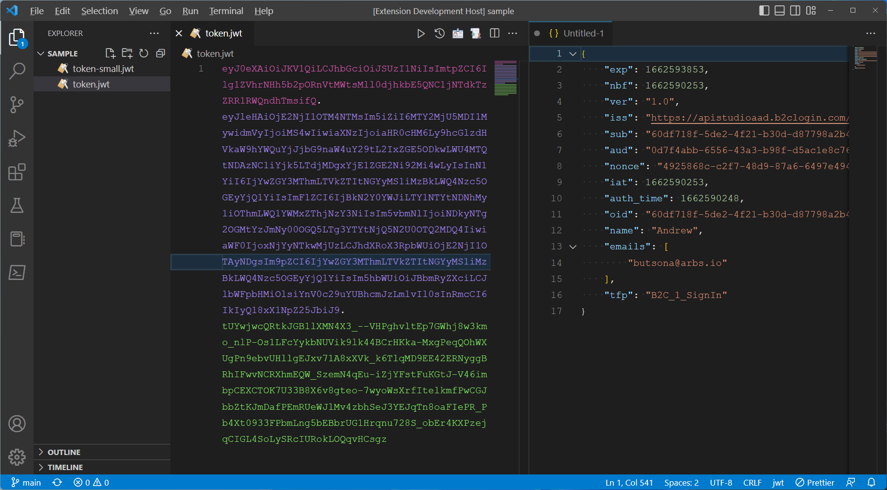

# vscode-jwt-decoder


[](https://github.com/arbs-io/vscode-jwt-decoder/issues)


[](https://sonarcloud.io/summary/new_code?id=arbs-io_vscode-jwt-decoder)
[](https://sonarcloud.io/summary/new_code?id=arbs-io_vscode-jwt-decoder)
[](https://sonarcloud.io/summary/new_code?id=arbs-io_vscode-jwt-decoder)
[](https://sonarcloud.io/summary/new_code?id=arbs-io_vscode-jwt-decoder)
[](https://sonarcloud.io/summary/new_code?id=arbs-io_vscode-jwt-decoder)

## Overview

vscode-jwt-decoder extension is a helpful tool for developers who regularly work with JSON Web Tokens (JWT). It seamlessly integrates with Visual Studio Code, allowing for quick and easy decoding of JWTs directly within the editor.

One of the main advantages of this extension is that it eliminates the need to copy live tokens to external websites for decoding. Instead, the extension works locally, providing a convenient and secure way to decode JWTs without the risk of exposing sensitive data to third-party sources.

It is important to note that the extension operates entirely on the user's local machine, and no data is ever transmitted or stored outside the user's device. This feature is critical for maintaining the privacy and security of token data, and it is a fundamental design principle of the vscode-jwt-decoder extension.

In summary, the vscode-jwt-decoder is a powerful, easy-to-use extension that allows developers to decode JWTs quickly and securely without transmitting data to external sources. It is an essential tool for anyone who works with JWTs regularly and is looking for a more efficient and secure way to decode these tokens.

## What is a JWT?

JSON Web Tokens (JWT) are a widely-adopted, industry-standard method for securely conveying claims between parties, as defined in the RFC 7519 specification. These tokens utilize a structured format to encode JSON data and are commonly used to verify the authenticity of the conveyed information cryptographically.

JWTs can be divided into JSON Web Signatures (JWS) and JSON Web Encryptions (JWE). JWS tokens contain public data, which anyone possessing the token can read. On the other hand, JWE tokens are encrypted and thus private, requiring both the token and a secret key to be deciphered. JWS tokens are the most commonly used type of JWT and include a signature, allowing for token validation. This extension is optimized to work with JWS tokens. However, support for JWE tokens may be added based on user demand.


## JWT Semantic Tokens

The vscode-jwt-decoder extension uses the Visual Studio Code Semantic Tokens API to improve the readability of JSON Web Tokens (JWT) within the editor. The Semantic Tokens API allows extensions to provide semantic tokens, or meta-information, about the contents of a document. VS Code can use this meta-information to improve the document's readability by applying syntax highlighting or other visual cues.

In the case of the vscode-jwt-decoder extension, the extension uses the Semantic Tokens API to provide semantic tokens for the various parts of a JWT, such as the header, payload, and signature. These semantic tokens can then apply syntax highlighting or other visual cues to make it easier to distinguish between the different parts of the JWT.

For example, the header and payload sections of the JWT can be highlighted in a different colour than the signature, making it easier to identify these parts of the token. Additionally, the extension can use semantic tokens to apply various colour schemes to other parts of the payload, depending on the type of data it represents.



## JWT Preview

The vscode-jwt-decoder extension uses the Visual Studio Code hover API to provide a preview of the JSON Web Token (JWT) JSON directly in the text editor. The hover API allows extensions to provide hover text displayed when the user hovers over a specific word or phrase within the editor.

In the case of the vscode-jwt-decoder extension, the extension uses the hover API to provide hover text for JWT tokens. When the user hovers over a JWT token, the extension will parse it and display a preview of the JWT header and claimset in JSON format. This allows the user to quickly view the token's contents without having to decode it manually or switch to a different tool. The hover text provided by the extension includes the header and payload and also consists of a button to decode the token.


## JWT Claimset Viewer

The vscode-jwt-decoder extension provides claims information by extracting the claims from the JSON Web Token (JWT) payload and displaying them in a user-friendly format.

When the user requests to decode a JWT, the payload is parsed as a JSON object, allowing the extension to access the individual properties and values of the data. The extension then iterates through the payload's properties and values, providing the value and a helpful description for each claim within the token. This information is displayed in a user-friendly format, such as a table or list, making it easy for the user to understand the data contained within the JWT.

The extension also recognizes standard JWT claims and formally describes the claim type. This helps users understand the meaning of claims they may need to become more familiar with.


## JWT Json Decoder

The vscode-jwt-decoder extension uses the jsonwebtoken library to decode JWTs into a raw JSON file. When the user requests to decode a JWT, the extension verifies the signature, extracts the payload, and then creates a new file in the user's workspace containing the payload data in raw JSON format, allowing the user to easily view and understand the data that is contained within the JWT.


## Build Info

Scripts included in the package to install and build the extension and all components. Github action include build for macOS, ubuntu and windows. Note yarn is required for the ubuntu build.

```bash
npm run install:all
npm run build:webview
```

## **How can I help?**

If you enjoy using the extension, please give it a rating on the [Visual Studio Marketplace](https://marketplace.visualstudio.com/items?itemName=AndrewButson.vscode-jwt-decoder).

Should you encounter bugs or if you have feature requests, head on over to the [GitHub repo](https://github.com/arbs-io/vscode-jwt-decoder) to open an issue if one doesn't already exist.
Pull requests are also very welcome since I can't always get around to fixing all bugs myself.

This is a personal passion project, so my time is limited.

Another way to help out is to [sponsor me on GitHub](https://github.com/sponsors/arbs-io).
